  

  

ML Engineering · Data Analytics · Data Engineering. I move data from ingestion to inference and have never once trusted a model that worked first try. I like the unglamorous middle of the pipeline — the schema arguments, the null that shouldn't exist, the metric that looks great until you ask it a second question. Curious by default, helpful by habit; half of what I know arrived via someone else's bug. Bring me your weird distributions.

  

## 🧠 About Me

I specialise across ML Engineering, Data Analytics and Data Engineering — a formal way of saying I like every stage of the trip from a messy CSV to something that actually makes a decision. Most of my time goes into agentic AI systems and anomaly detection, and most of my actual learning comes from things breaking in ways the documentation never warned me about.

I'm the sort of person who reads the error message twice, then asks why it exists at all. Other people's bugs are genuinely interesting to me — half of what I know arrived that way, over someone's shoulder at an unreasonable hour. So if you're stuck, say so. Worst case we're stuck together, which is still a considerable improvement on stuck alone.

## 🧭 How I Work

I start by arguing with the problem, not the code. Most of the time I've lost went to building the right thing badly rather than the wrong thing well, so I've learned to spend the first hour asking what happens if this is off by a factor of ten, and who finds out.

I write things down before I write them up — assumptions especially. They're the part everyone forgets they made, right up until the day the data changes underneath them.

I'd rather ship something plain that survives Monday morning than something clever I have to explain every time it breaks. Clever code is a loan against your own future attention, and the interest is brutal.

And I ask questions early and without embarrassment. There's no prize for being the last person to admit they were confused.

## 📐 FIG. 01 — System Overview

  

every figure on this drawing is queried live from the GitHub API and redrawn daily &#183; <a href="./scripts/render.py">see the renderer</a>

## 📓 Field Notes

Things I've learned the slow way, written down so I stop relearning them.

- **Most model problems are data problems wearing a trench coat.** Before tuning anything, go look at fifty rows with your own eyes.
- **Nulls are never missing at random.** Somebody's process made them. Find the process, not the imputation strategy.
- **A notebook that runs top to bottom once isn't reproducible — it's lucky.** The state you can't see is the state that ruins you.
- **The metric everyone celebrates is usually the one nobody defined.** Ask what it means before you ask how to improve it.
- **Every dashboard eventually becomes somebody's source of truth,** whether or not it was built to be. Design like it will be.
- **If a pipeline has no monitoring, it doesn't have a state — it has rumours.** "It's probably fine" is not an observability strategy.

## 🚀 Contribution Record, But It's Galaga

<picture>
  <source media="(prefers-color-scheme: dark)" srcset="https://raw.githubusercontent.com/Sd474/Sd474/output/galaga-contribution-graph-dark.svg">
  <source media="(prefers-color-scheme: light)" srcset="https://raw.githubusercontent.com/Sd474/Sd474/output/galaga-contribution-graph.svg">
  
</picture>

a fighter ship shoots down a year of commits &#183; generated with <a href="https://github.com/abozanona/pacman-contribution-graph">abozanona/pacman-contribution-graph</a>

## 🤖 LLMs & Agentic AI

&nbsp;&nbsp;
&nbsp;&nbsp;
&nbsp;&nbsp;
&nbsp;&nbsp;
&nbsp;&nbsp;
&nbsp;&nbsp;
&nbsp;&nbsp;
&nbsp;&nbsp;
&nbsp;&nbsp;

LangChain · LangGraph · LangSmith · RAG pipelines · vector stores · agentic tool-use

  

## 🗣️ Natural Language Processing

&nbsp;&nbsp;
&nbsp;&nbsp;
&nbsp;&nbsp;
&nbsp;&nbsp;
&nbsp;&nbsp;
&nbsp;&nbsp;

tokenisation · embeddings · NER · transformers · semantic search · fine-tuning

## 🌊 Data Engineering & Streaming

&nbsp;&nbsp;
&nbsp;&nbsp;
&nbsp;&nbsp;
&nbsp;&nbsp;
&nbsp;&nbsp;
&nbsp;&nbsp;
&nbsp;&nbsp;
&nbsp;&nbsp;
&nbsp;&nbsp;
&nbsp;&nbsp;
&nbsp;&nbsp;
&nbsp;&nbsp;
&nbsp;&nbsp;

batch &amp; stream pipelines · orchestration · CDC · warehousing · lakehouse patterns

## 📊 Data Analytics

&nbsp;&nbsp;
&nbsp;&nbsp;
&nbsp;&nbsp;
&nbsp;&nbsp;
&nbsp;&nbsp;
&nbsp;&nbsp;
&nbsp;&nbsp;
&nbsp;&nbsp;
&nbsp;&nbsp;
&nbsp;&nbsp;

exploratory analysis · statistical testing · dashboarding · SQL at volume

## 🛠️ Core Stack &amp; Infrastructure

&nbsp;&nbsp;
&nbsp;&nbsp;
&nbsp;&nbsp;
&nbsp;&nbsp;
&nbsp;&nbsp;
&nbsp;&nbsp;
&nbsp;&nbsp;
&nbsp;&nbsp;
&nbsp;&nbsp;
&nbsp;&nbsp;
&nbsp;&nbsp;
&nbsp;&nbsp;
&nbsp;&nbsp;

## 🌱 Currently Learning

Agentic systems and where they quietly fall over — retrieval quality, tool-use reliability, and what "evaluation" means when the output is a paragraph rather than a number.

Alongside that: distributed data processing, the operational side of ML that nobody puts in tutorials, and enough statistics to know when I'm fooling myself. That last one is a permanent project.

### 👋 Say Hi

I answer messages, including the ones that begin "this is probably a stupid question." It usually isn't, and if it is, that's fine too — I've asked worse.

Happy to talk through a problem you're stuck on, look at something you're building, or just compare notes. No agenda.

## 🌐 Connect With Me

&nbsp;&nbsp;&nbsp;

  

